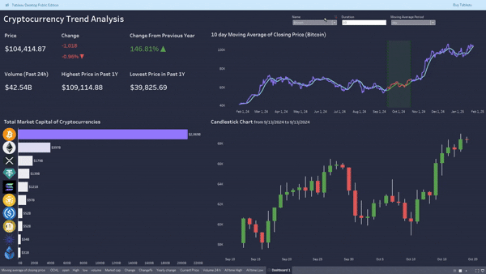

# Cryptocurrency Trend Analysis

## Overview
This project involves **web scraping** cryptocurrency data from [Yahoo Finance](https://finance.yahoo.com/markets/crypto/all/) using **Python** (BeautifulSoup & Selenium) and visualizing the trends through an interactive **Tableau dashboard**. The dashboard provides insights into price trends, market capitalization, and trading volume, helping investors and analysts track cryptocurrency performance.

## Tech Stack & Tools
- **Python** (BeautifulSoup, Selenium) – for web scraping cryptocurrency data  
- **Pandas** – for data cleaning and manipulation  
- **[Tableau](https://public.tableau.com/views/Cryptoanalysis_17380930488290/Dashboard1?:language=en-US&:sid=&:redirect=auth&:display_count=n&:origin=viz_share_link)** – for data visualization and dashboard creation 

## Key Features
- Web scraping to collect real-time cryptocurrency data  
- Data cleaning and preprocessing  
- Interactive Tableau dashboard with price trends, market cap, and volume analysis  
- Candlestick charts and moving averages for trend analysis  

## Key Findings
1. **Bitcoin currently has the highest price** ($104,414.87) among all cryptocurrencies.  
2. On **January 25, 2025**, every cryptocurrency (except **USD Coin**) is slightly declining.  
3. **Significant yearly growth**, with **XRP having the highest growth rate (488.33%)**.  
4. **Historical price range analysis**:  
   - **Bitcoin’s highest price:** $109,114.88  
   - **Bitcoin’s lowest price:** $39,825.69  
5. **Bitcoin dominates the market** with a capitalization of **$2.069T**.  
6. **24-hour trading volume** indicates **high liquidity and market activity**.  
7. **Moving average closing prices** help forecast trends and market direction.  
8. **Candlestick chart analysis**:  
   - Displays price movements, fluctuations, and volatility.  
   - On **January 20, 2025**, Bitcoin experienced **high volatility**.  

## Key Takeaways 
- **Strong yearly growth**  
- **High trading volume**  
- **Bitcoin remains the dominant cryptocurrency**  

## How to Use the Project

### 1. Clone the Repository
```bash
git clone https://github.com/your-username/cryptocurrency-trend-analysis.git](https://github.com/Saif044/Crypto-trading-Analysis.git
```
### 2. Install Dependencies
```bash
pip install -r requirements.txt
```
### 3. Run the crypto_name_symbol.py to extract the current price, names, symbols
```bash
python Script/crypto_name_symbol.py
```
### 4. Run the historical_data.py to extract historical data 
```bash
python Script/historical_data.py
```
### 5. Data Preprocessing
For later analysis, some data columns are preprocessed by using Preprocessing.ipynb

## Tableau Dashboard Highlights  
📊 **Current price, daily & yearly changes, highest & lowest price for the selected period**  
📈 **Moving average trend analysis of closing price with interactive selection.**  
💰 **Market capitalization breakdown of top cryptocurrencies. Also in the data label, trending line charts of (Open, High, Low, and Volume) are given for better analysis**  
📉 **Candlestick chart for price fluctuations**  

🔗 [Click here to see the Tableau Dashboard](https://public.tableau.com/views/Cryptoanalysis_17380930488290/Dashboard1?:language=en-US&:sid=&:redirect=auth&:display_count=n&:origin=viz_share_link)

## 🖼️ Preview


## Future Improvements
- Automate the data pipeline for real-time updates  
- Add predictive models for price forecasting  
- Expand analysis to include more cryptocurrencies 
